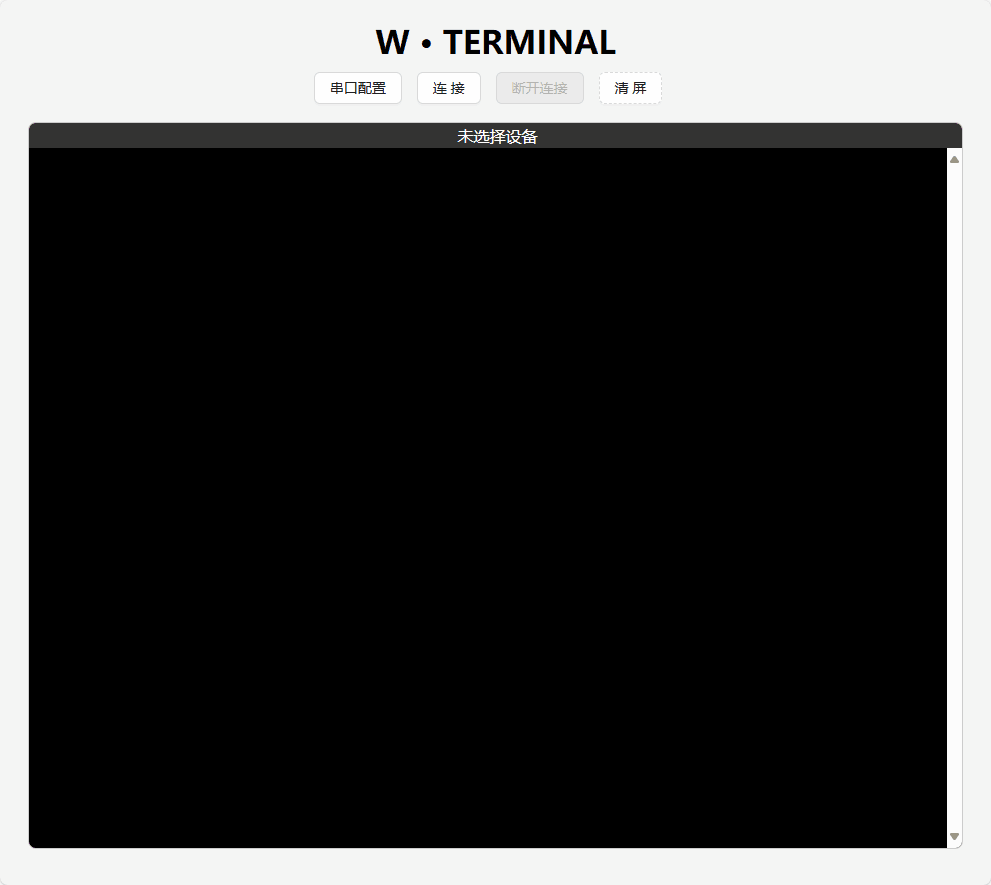

# W·Terminal



每次换电脑总要找各种串口终端软件，很烦。

有的软件要付费，有的软件要注册，很烦。

找到免费的，还得先下载下来，很烦。

开源的软件下载速度不稳定，很烦。

公司电脑有监控还得让 IT 同事来安装，烦死了。

。。。

算了，最近浏览器（谷歌，Edge）也支持打开串口了，就自己搞一个网页版终端吧，有网就行。

没网怎么办？额，虽然你也可以本地部署，但这种情况下似乎比 U 盘拷个软件安装更麻烦，就大大方方承认在这方面确实不行吧。

哦对了，也不只是这方面，功能上除了终端功能啥也没有，这方面也被各大终端软件吊打。

业余写写，可能会有 BUG 。

以上，介绍完了。


## 推荐的开发工具

[VSCode](https://code.visualstudio.com/) + [Volar](https://marketplace.visualstudio.com/items?itemName=Vue.volar) (and disable Vetur).

## 自定义配置

参考 [Vite Configuration Reference](https://vitejs.dev/config/).

## 工程环境安装

```sh
pnpm install
```

### 启动开发服务器

```sh
pnpm dev
```

### 打包

```sh
pnpm build
```

